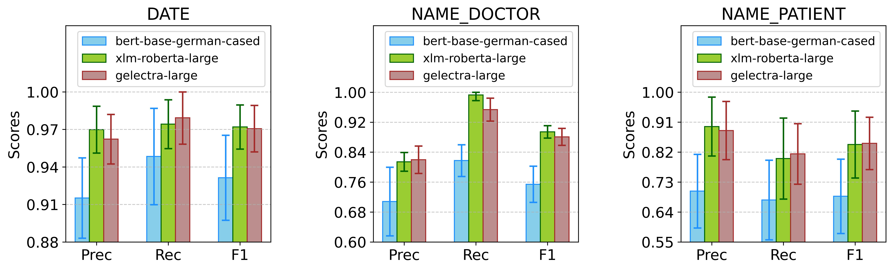
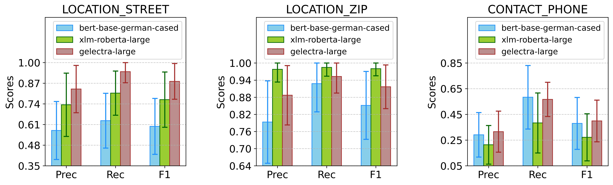

# redakt-grascco

For developing NER models based on [GraSCCo_PHI](https://zenodo.org/records/11502329) corpus.

## About GraSCCo corpus

GraSCCo - short for <u>Gra</u>z <u>S</u>ynthetic <u>C</u>linical text <u>Co</u>rpus - is a collection of artificially generated semi-structured and unstructured German-language clinical summaries designed to support research in clinical Natural Language Processing (cNLP).

Research Article: [GRASCCO — The First Publicly Shareable, Multiply-Alienated German Clinical Text Corpus](https://ebooks.iospress.nl/doi/10.3233/SHTI220805)<br>
Zenodo Data Repository: https://zenodo.org/records/6539131

Later, the corpus was annotated with PHI (Protected Health Information) entities. The annotations were exported XMI and JSON formats created with the INCEpTION annotation platform.

Research Article: [De-Identifying GRASCCO – A Pilot Study for the De-Identification of the German Medical Text Project (GeMTeX) Corpus](https://ebooks.iospress.nl/doi/10.3233/SHTI240853) <br>
Zenodo Data Repository: https://zenodo.org/records/11502329

## Data pre-processing and insights

For feature analysis and data preparation to fine-tune NER models, [JSON exports](data/raw/11502329/grascco_phi_annotation_json) of the corpus are utilized.

The following keys are used to extract relevant information from the JSON files:
1. **%FEATURE_STRUCTURES** - the root object key that contains arrays of sentences, tokens, whole text and PHI information, each object in these arrays contains a **%TYPE** key to identify the type of information
2. **de.tudarmstadt.ukp.dkpro.core.api.metadata.type.DocumentMetaData** - the value of **%TYPE** key - used to access document-level metadata, such as title
3. **de.tudarmstadt.ukp.dkpro.core.api.segmentation.type.Sentence** - the value of **%TYPE** key - used to access sentence-level boundaries
4. **de.tudarmstadt.ukp.dkpro.core.api.segmentation.type.Token** - the value of **%TYPE** key - used to access token-level boundaries
5. **uima.cas.Sofa** - the value of **%TYPE** key - used to access the whole text of the document
6. **webanno.custom.PHI** - the value of **%TYPE** key - used to access PHI entity-level boundaries and labels

The processing and extraction done can be tracked in [src/data_handlers/grascco_data_handler.py](src/data_handlers/grascco_data_handler.py) script.

While extracting data, some inconsistencies were found in the annotations - 

**(a)** Label key (**kind**) was missing for the last entity (**AGE**) in **Queisser.txt** [document](data/raw/11502329/grascco_phi_annotation_json/Queisser.txt_phi.json).

| Document Title  | Boundary     | Token  | Sentence                     |
|-----------------|--------------|--------|------------------------------|
| Queisser.txt    | (1219, 1221) | 49     | Untersuchungsbefund: 49jähr. |

This entity with missing label was fixed manually by marking it as an **AGE** entity.

<br>
The final statistics of the processed annotations are as follows:

| Metric                   | Value      |
| ------------------------ | ---------- |
| Total Files              | **63**     |
| Total Sentences          | **2,872**  |
| Total Tokens             | **41,992** |
| Total Labels             | **19**     |
| Total Annotated Entities | **1,439**  |

While the [annotation guideline](data/raw/11502329/_Annoguide____GeMTeX___DeID.pdf) lists in total 23 labels but only 19 can be found in these annotations.

Such missing labels are:

1. **CONTACT_URL**
2. **LOCATION_STATE**
3. **LOC_OTHER**
4. **NAME_OTHER**

**(b)** Wrong counts for two labels, **LOCATION_CITY** and **LOCATION_ZIP**, were reported in the original [Research Article](https://ebooks.iospress.nl/doi/10.3233/SHTI240853), values swapped in consequent rows.

 N | Label                  | Count | Count (RA) | Note
---| -----------------------| ----- |------------|---------------------------------
01 | DATE                   | 694   | 694        |
02 | NAME\_PATIENT          | 166   | 166        |
03 | NAME\_DOCTOR           | 154   | 154        |
04 | NAME\_TITLE            | 139   | 139        |
05 | LOCATION\_CITY         | 59    | 38         | Wrong count in RA, actual is 59
06 | ID                     | 58    | 58         |
07 | LOCATION\_ZIP          | 38    | 59         | Wrong count in RA, actual is 38
08 | LOCATION\_HOSPITAL     | 36    | 36         |
09 | LOCATION\_STREET       | 36    | 36         |
10 | AGE                    | 24    | 23         | Manually fixed one missing label
11 | CONTACT\_PHONE         | 18    | 18         |
12 | CONTACT\_FAX           | 7     | 7          |
13 | LOCATION\_COUNTRY      | 2     | 2          |
14 | LOCATION\_ORGANIZATION | 2     | 2          |
15 | PROFESSION             | 2     | 2          |
16 | CONTACT\_EMAIL         | 1     | 1          |
17 | NAME\_EXT              | 1     | 1          |
18 | NAME\_RELATIVE         | 1     | 1          |
19 | NAME\_USERNAME         | 1     | 1          |

List of all LOCATION_CITY (59) entities in different documents:
```
1. Alt-Neudorf, 2. Bad Arolsen, 3. Belgrad, 4. Berlin, 5. Berlin, 6. Berlin, 7. Berlin, 8. Berlin, 9. Berlin, 10. Bruchsal, 11. Crailsheim, 12. Flensburg, 13. Flensburg, 14. Flensburg, 15. Freiburg, 16. Freudenbrunn, 17. Gingen, 18. Graz, 19. Heidelberg, 20. Heidelberg, 21. Herborn, 22. Holzhausen, 23. Holzhausen, 24. Jena, 25. Kiel, 26. Klagenfurt, 27. Klagenfurt, 28. Klagenfurt, 29. Klagenfurt, 30. Klein Haasbeck, 31. Klein Haasbeck, 32. Klein Haasbeck, 33. Krefeld, 34. Krefeld, 35. München, 36. Neudorf, 37. Neukirchen, 38. Neustadt, 39. Neustadt, 40. Neustadt, 41. Neustadt, 42. Neustadt, 43. Neustadt, 44. Neustadt, 45. Neustadt, 46. Opfing, 47. Opfing, 48. Opfing, 49. St. Anna im Tale, 50. St. Johann am Bergle, 51. Stuttgart, 52. Trüllikon (ZH), 53. Villach, 54. Villach, 55. Weimar, 56. Wiesental, 57. Wiesental, 58. Wilhelmsburg, 59. Wilhelmsburg
```

List of all LOCATION_ZIP (38) entities in different documents:
```
1. 01334, 2. 09221, 3. 10117, 4. 10117, 5. 10247, 6. 12299, 7. 20223, 8. 20223, 9. 24937, 10. 24941, 11. 33455, 12. 33455, 13. 34443, 14. 35745, 15. 47809, 16. 47809, 17. 69115, 18. 72119, 19. 73333, 20. 76646, 21. 8010, 22. 9010, 23. 9011, 24. 9020, 25. 91022, 26. A-2236, 27. A-2236, 28. A-2236, 29. A-3336, 30. A-3337, 31. A-8120, 32. A-9011, 33. A-9011, 34. A-9011, 35. A-9011, 36. A-9011, 37. A-9012, 38. A-9580
```

<br>

**Rarely (count <= 10)** present labels and entities:

| Label                | Entity                            | Document Title          | Begin | End  |
|----------------------|-----------------------------------|-------------------------|-------|------|
| CONTACT_EMAIL        | termin.dot@uniklinik-berlin.de    | Weil.txt                | 392   | 422  |
| CONTACT_FAX          | 02216/325-15338                   | Dupuytren.txt           | 206   | 221  |
| CONTACT_FAX          | 0816/333-13284                    | Joubert.txt             | 141   | 155  |
| CONTACT_FAX          | +43 (453) 14-592-12098            | Meulengracht.txt        | 195   | 217  |
| CONTACT_FAX          | +43(0)333 775-8422334             | Schielaug.txt           | 171   | 192  |
| CONTACT_FAX          | +43(0)333 775-8447334             | Schuh.txt               | 187   | 208  |
| CONTACT_FAX          | +43(0)333 775-8447339             | Schuh.txt               | 331   | 352  |
| CONTACT_FAX          | 030 110-2619 o. 2452              | Weil.txt                | 371   | 391  |
| LOCATION_COUNTRY     | USA                               | Recklinghausen.txt      | 203   | 206  |
| LOCATION_COUNTRY     | Peru                              | Waldenström.txt         | 1020  | 1024 |
| LOCATION_ORGANIZATION| BVA                               | Joubert.txt             | 442   | 445  |
| LOCATION_ORGANIZATION| Alpen-Adria-Universität Kragenfurt| Theodor.txt             | 2686  | 2720 |
| NAME_EXT             | Fuß                               | Fleischmann.txt         | 5579  | 5582 |
| NAME_RELATIVE        | Alois Alzheimer                   | Amanda_Alzheimer.txt    | 6126  | 6141 |
| NAME_USERNAME        | WinA.                             | Tupolev_3.txt           | 298   | 303  |
| PROFESSION           | Floristin                         | Boeck.txt               | 1572  | 1581 |
| PROFESSION           | Maschinenbauingenieur             | Theodor.txt             | 2608  | 2629 |

A separate pandas [dataframe](data/grascco_ner_data.csv) is prepared with rows for all the documents and with additionally prepared BIOES tagged tokenized text per document to facilitate fine-tuning and evaluation.

Columns:<br>

1. **ID**
2. **document_title**
3. **document_text**
4. **sentences**
5. **tokens**
6. **entities**
7. **sentence_count**
8. **token_count**
9. **entity_count**
10. **label_wise_entity_count**
11. **bioes_text**


## Data preparation for NER model fine-tuning

Before preparing a 5-fold cross-validation setup, to evenly distribute rarely present entities:

1. files containing labels with one entity - **CONTACT_EMAIL - Weil.txt**, **NAME_EXT - Fleischmann.txt**, **NAME_RELATIVE - Amanda_Alzheimer.txt** and **NAME_USERNAME - Tupolev_3.txt**  are kept in the training set, if we keep aside these files from any split, we loose significant amount of tokens and other entities that are present in these files.

2. files containing labels with two entities (e.g. **LOCATION_COUNTRY - Recklinghausen.txt, Waldenström.txt**) are split such that one file goes to train set and the other to test set.

3. files containing labels with three or more entities (e.g. **CONTACT_FAX**) are split such that one file goes to train set, one to dev set and the other to test set.


After this setup - train/dev/test sets contains the following files in every fold along with fold-wise rest of the files:

| Train (7)                  | Dev (2)            | Test (4)                    |
|----------------------------|--------------------|-----------------------------|
| Weil.txt<br>Fleischmann.txt<br>Amanda_Alzheimer.txt<br>Tupolev_3.txt<br>Schielaug.txt<br>Waldenström.txt<br>Theodor.txt| Schuh.txt<br>Dupuytren.txt | Joubert.txt<br>Meulengracht.txt<br>Recklinghausen.txt<br>Boeck.txt |

In the next step, with the rest 50 files a 5-fold cross validation split is performed - to create 5 separate train(60%)/dev(20%)/test(20%) sets with rolling.

| Stat/Label           | Fold 1                                 | Fold 2                                   | Fold 3                                   | Fold 4                                   | Fold 5                                   |
|-----------------------|------------------------------------------|------------------------------------------|------------------------------------------|------------------------------------------|------------------------------------------|
| Total Files           | Train: 37<br>Dev: 12<br>Test: 14         | Train: 37<br>Dev: 12<br>Test: 14         | Train: 37<br>Dev: 12<br>Test: 14         | Train: 37<br>Dev: 12<br>Test: 14         | Train: 37<br>Dev: 12<br>Test: 14         |
| Total Sentences       | Train: 1527<br>Dev: 626<br>Test: 719     | Train: 1759<br>Dev: 664<br>Test: 449     | Train: 1973<br>Dev: 394<br>Test: 505     | Train: 1944<br>Dev: 450<br>Test: 478     | Train: 1768<br>Dev: 423<br>Test: 681     |
| Total Tokens          | Train: 21923<br>Dev: 8713<br>Test: 11356 | Train: 25161<br>Dev: 10605<br>Test: 6226 | Train: 29160<br>Dev: 5475<br>Test: 7357  | Train: 28668<br>Dev: 6606<br>Test: 6718  | Train: 26561<br>Dev: 5967<br>Test: 9464  |
| Total Entities        | Train: 821<br>Dev: 282<br>Test: 336      | Train: 877<br>Dev: 321<br>Test: 241      | Train: 950<br>Dev: 226<br>Test: 263      | Train: 919<br>Dev: 248<br>Test: 272      | Train: 885<br>Dev: 257<br>Test: 297      |
| Train Files           | Amanda_Alzheimer.txt<br>Baastrup.txt<br>Beuerle.txt<br>Colon_Fake_A.txt<br>Colon_Fake_B.txt<br>Colon_Fake_C.txt<br>Colon_Fake_D.txt<br>Colon_Fake_E.txt<br>Colon_Fake_G.txt<br>Colon_Fake_I.txt<br>Colon_Fake_K.txt<br>Ehrenberger.txt<br>Fleischmann.txt<br>Haefner.txt<br>Jenninger.txt<br>Koenig.txt<br>Leitner.txt<br>Meyr.txt<br>Neubauer.txt<br>Osler.txt<br>Queisser.txt<br>Quervain.txt<br>Rieser.txt<br>Schielaug.txt<br>Stölzl.txt<br>Sudeck.txt<br>Theodor.txt<br>Tupolev_1.txt<br>Tupolev_2.txt<br>Tupolev_3.txt<br>Tupolev_4.txt<br>Utz.txt<br>Vogler.txt<br>Waldenström.txt<br>Weil.txt<br>Xavier.txt<br>Ypsilanti.txt | Albers.txt<br>Amanda_Alzheimer.txt<br>Baastrup.txt<br>Clausthal.txt<br>Colon_Fake_A.txt<br>Colon_Fake_E.txt<br>Colon_Fake_F.txt<br>Colon_Fake_G.txt<br>Colon_Fake_I.txt<br>Colon_Fake_J.txt<br>Colon_Fake_K.txt<br>Dewald.txt<br>Ehrenberger.txt<br>Fleischmann.txt<br>Gebauer.txt<br>Jadassohn.txt<br>Kawasaki.txt<br>Meyr.txt<br>Neubauer.txt<br>Osler.txt<br>Praechtel.txt<br>Queisser.txt<br>Quervain.txt<br>Rieser.txt<br>Schielaug.txt<br>Stölzl.txt<br>Sudeck.txt<br>Theodor.txt<br>Tupolev_1.txt<br>Tupolev_2.txt<br>Tupolev_3.txt<br>Vogler.txt<br>Waldenström.txt<br>Wankel.txt<br>Weil.txt<br>Xavier.txt<br>Ypsilanti.txt | Albers.txt<br>Amanda_Alzheimer.txt<br>Baastrup.txt<br>Cajal.txt<br>Clausthal.txt<br>Colon_Fake_E.txt<br>Colon_Fake_F.txt<br>Colon_Fake_G.txt<br>Colon_Fake_H.txt<br>Colon_Fake_I.txt<br>Colon_Fake_J.txt<br>Dewald.txt<br>Ehrenberger.txt<br>Fabry.txt<br>Fleischmann.txt<br>Fuss.txt<br>Gebauer.txt<br>Ilgner.txt<br>Jadassohn.txt<br>Kawasaki.txt<br>Obradovic.txt<br>Popovic.txt<br>Praechtel.txt<br>Queisser.txt<br>Rieser.txt<br>Schielaug.txt<br>Schnitzler.txt<br>Theodor.txt<br>Tupolev_1.txt<br>Tupolev_3.txt<br>Vogler.txt<br>Waldenström.txt<br>Wankel.txt<br>Weber.txt<br>Weil.txt<br>Xavier.txt<br>Zezelj.txt | Albers.txt<br>Amanda_Alzheimer.txt<br>Beuerle.txt<br>Cajal.txt<br>Clausthal.txt<br>Colon_Fake_B.txt<br>Colon_Fake_C.txt<br>Colon_Fake_D.txt<br>Colon_Fake_F.txt<br>Colon_Fake_H.txt<br>Colon_Fake_J.txt<br>Dewald.txt<br>Fabry.txt<br>Fleischmann.txt<br>Fuss.txt<br>Gebauer.txt<br>Haefner.txt<br>Ilgner.txt<br>Jadassohn.txt<br>Jenninger.txt<br>Kawasaki.txt<br>Koenig.txt<br>Leitner.txt<br>Obradovic.txt<br>Popovic.txt<br>Praechtel.txt<br>Schielaug.txt<br>Schnitzler.txt<br>Theodor.txt<br>Tupolev_3.txt<br>Tupolev_4.txt<br>Utz.txt<br>Waldenström.txt<br>Wankel.txt<br>Weber.txt<br>Weil.txt<br>Zezelj.txt | Amanda_Alzheimer.txt<br>Beuerle.txt<br>Cajal.txt<br>Colon_Fake_A.txt<br>Colon_Fake_B.txt<br>Colon_Fake_C.txt<br>Colon_Fake_D.txt<br>Colon_Fake_H.txt<br>Colon_Fake_K.txt<br>Fabry.txt<br>Fleischmann.txt<br>Fuss.txt<br>Haefner.txt<br>Ilgner.txt<br>Jenninger.txt<br>Koenig.txt<br>Leitner.txt<br>Meyr.txt<br>Neubauer.txt<br>Obradovic.txt<br>Osler.txt<br>Popovic.txt<br>Quervain.txt<br>Schielaug.txt<br>Schnitzler.txt<br>Stölzl.txt<br>Sudeck.txt<br>Theodor.txt<br>Tupolev_2.txt<br>Tupolev_3.txt<br>Tupolev_4.txt<br>Utz.txt<br>Waldenström.txt<br>Weber.txt<br>Weil.txt<br>Ypsilanti.txt<br>Zezelj.txt |
| Dev Files             | Albers.txt<br>Clausthal.txt<br>Colon_Fake_F.txt<br>Colon_Fake_J.txt<br>Dewald.txt<br>Dupuytren.txt<br>Gebauer.txt<br>Jadassohn.txt<br>Kawasaki.txt<br>Praechtel.txt<br>Schuh.txt<br>Wankel.txt | Cajal.txt<br>Colon_Fake_H.txt<br>Dupuytren.txt<br>Fabry.txt<br>Fuss.txt<br>Ilgner.txt<br>Obradovic.txt<br>Popovic.txt<br>Schnitzler.txt<br>Schuh.txt<br>Weber.txt<br>Zezelj.txt | Beuerle.txt<br>Colon_Fake_B.txt<br>Colon_Fake_C.txt<br>Colon_Fake_D.txt<br>Dupuytren.txt<br>Haefner.txt<br>Jenninger.txt<br>Koenig.txt<br>Leitner.txt<br>Schuh.txt<br>Tupolev_4.txt<br>Utz.txt | Colon_Fake_A.txt<br>Colon_Fake_K.txt<br>Dupuytren.txt<br>Meyr.txt<br>Neubauer.txt<br>Osler.txt<br>Quervain.txt<br>Schuh.txt<br>Stölzl.txt<br>Sudeck.txt<br>Tupolev_2.txt<br>Ypsilanti.txt | Baastrup.txt<br>Colon_Fake_E.txt<br>Colon_Fake_G.txt<br>Colon_Fake_I.txt<br>Dupuytren.txt<br>Ehrenberger.txt<br>Queisser.txt<br>Rieser.txt<br>Schuh.txt<br>Tupolev_1.txt<br>Vogler.txt<br>Xavier.txt |
| Test Files            | Boeck.txt<br>Cajal.txt<br>Colon_Fake_H.txt<br>Fabry.txt<br>Fuss.txt<br>Ilgner.txt<br>Joubert.txt<br>Meulengracht.txt<br>Obradovic.txt<br>Popovic.txt<br>Recklinghausen.txt<br>Schnitzler.txt<br>Weber.txt<br>Zezelj.txt | Beuerle.txt<br>Boeck.txt<br>Colon_Fake_B.txt<br>Colon_Fake_C.txt<br>Colon_Fake_D.txt<br>Haefner.txt<br>Jenninger.txt<br>Joubert.txt<br>Koenig.txt<br>Leitner.txt<br>Meulengracht.txt<br>Recklinghausen.txt<br>Tupolev_4.txt<br>Utz.txt | Boeck.txt<br>Colon_Fake_A.txt<br>Colon_Fake_K.txt<br>Joubert.txt<br>Meulengracht.txt<br>Meyr.txt<br>Neubauer.txt<br>Osler.txt<br>Quervain.txt<br>Recklinghausen.txt<br>Stölzl.txt<br>Sudeck.txt<br>Tupolev_2.txt<br>Ypsilanti.txt | Baastrup.txt<br>Boeck.txt<br>Colon_Fake_E.txt<br>Colon_Fake_G.txt<br>Colon_Fake_I.txt<br>Ehrenberger.txt<br>Joubert.txt<br>Meulengracht.txt<br>Queisser.txt<br>Recklinghausen.txt<br>Rieser.txt<br>Tupolev_1.txt<br>Vogler.txt<br>Xavier.txt | Albers.txt<br>Boeck.txt<br>Clausthal.txt<br>Colon_Fake_F.txt<br>Colon_Fake_J.txt<br>Dewald.txt<br>Gebauer.txt<br>Jadassohn.txt<br>Joubert.txt<br>Kawasaki.txt<br>Meulengracht.txt<br>Praechtel.txt<br>Recklinghausen.txt<br>Wankel.txt |
| DATE                  | Train: 398<br>Dev: 158<br>Test: 138      | Train: 448<br>Dev: 128<br>Test: 118      | Train: 462<br>Dev: 108<br>Test: 124      | Train: 456<br>Dev: 114<br>Test: 124      | Train: 412<br>Dev: 114<br>Test: 168      |
| NAME_PATIENT          | Train: 88<br>Dev: 35<br>Test: 43         | Train: 99<br>Dev: 38<br>Test: 29         | Train: 113<br>Dev: 24<br>Test: 29        | Train: 113<br>Dev: 24<br>Test: 29        | Train: 102<br>Dev: 24<br>Test: 40        |
| NAME_DOCTOR           | Train: 91<br>Dev: 24<br>Test: 39         | Train: 96<br>Dev: 39<br>Test: 19         | Train: 106<br>Dev: 19<br>Test: 29        | Train: 98<br>Dev: 29<br>Test: 27         | Train: 103<br>Dev: 27<br>Test: 24        |
| NAME_TITLE            | Train: 84<br>Dev: 23<br>Test: 32         | Train: 84<br>Dev: 32<br>Test: 23         | Train: 91<br>Dev: 23<br>Test: 25         | Train: 90<br>Dev: 25<br>Test: 24         | Train: 92<br>Dev: 24<br>Test: 23         |
| LOCATION_CITY         | Train: 32<br>Dev: 9<br>Test: 18          | Train: 29<br>Dev: 20<br>Test: 10         | Train: 36<br>Dev: 12<br>Test: 11         | Train: 35<br>Dev: 13<br>Test: 11         | Train: 39<br>Dev: 13<br>Test: 7          |
| ID                    | Train: 37<br>Dev: 6<br>Test: 15          | Train: 32<br>Dev: 13<br>Test: 13         | Train: 33<br>Dev: 11<br>Test: 14         | Train: 28<br>Dev: 12<br>Test: 18         | Train: 34<br>Dev: 16<br>Test: 8          |
| LOCATION_ZIP          | Train: 20<br>Dev: 5<br>Test: 13          | Train: 17<br>Dev: 13<br>Test: 8          | Train: 21<br>Dev: 8<br>Test: 9           | Train: 21<br>Dev: 9<br>Test: 8           | Train: 25<br>Dev: 8<br>Test: 5           |
| LOCATION_HOSPITAL     | Train: 20<br>Dev: 7<br>Test: 9           | Train: 25<br>Dev: 9<br>Test: 2           | Train: 28<br>Dev: 2<br>Test: 6           | Train: 23<br>Dev: 6<br>Test: 7           | Train: 22<br>Dev: 7<br>Test: 7           |
| LOCATION_STREET       | Train: 19<br>Dev: 5<br>Test: 12          | Train: 17<br>Dev: 12<br>Test: 7          | Train: 22<br>Dev: 7<br>Test: 7           | Train: 20<br>Dev: 7<br>Test: 9           | Train: 22<br>Dev: 9<br>Test: 5           |
| AGE                   | Train: 16<br>Dev: 2<br>Test: 6           | Train: 14<br>Dev: 5<br>Test: 5           | Train: 18<br>Dev: 4<br>Test: 2           | Train: 17<br>Dev: 1<br>Test: 6           | Train: 16<br>Dev: 5<br>Test: 3           |
| CONTACT_PHONE         | Train: 7<br>Dev: 5<br>Test: 6            | Train: 7<br>Dev: 9<br>Test: 2            | Train: 11<br>Dev: 5<br>Test: 2           | Train: 9<br>Dev: 5<br>Test: 4            | Train: 9<br>Dev: 7<br>Test: 2            |
| CONTACT_FAX           | Train: 2<br>Dev: 3<br>Test: 2            | Train: 2<br>Dev: 3<br>Test: 2            | Train: 2<br>Dev: 3<br>Test: 2            | Train: 2<br>Dev: 3<br>Test: 2            | Train: 2<br>Dev: 3<br>Test: 2            |
| LOCATION_COUNTRY      | Train: 1<br>Dev: 0<br>Test: 1            | Train: 1<br>Dev: 0<br>Test: 1            | Train: 1<br>Dev: 0<br>Test: 1            | Train: 1<br>Dev: 0<br>Test: 1            | Train: 1<br>Dev: 0<br>Test: 1            |
| LOCATION_ORGANIZATION | Train: 1<br>Dev: 0<br>Test: 1            | Train: 1<br>Dev: 0<br>Test: 1            | Train: 1<br>Dev: 0<br>Test: 1            | Train: 1<br>Dev: 0<br>Test: 1            | Train: 1<br>Dev: 0<br>Test: 1            |
| PROFESSION            | Train: 1<br>Dev: 0<br>Test: 1            | Train: 1<br>Dev: 0<br>Test: 1            | Train: 1<br>Dev: 0<br>Test: 1            | Train: 1<br>Dev: 0<br>Test: 1            | Train: 1<br>Dev: 0<br>Test: 1            |
| CONTACT_EMAIL         | Train: 1<br>Dev: 0<br>Test: 0            | Train: 1<br>Dev: 0<br>Test: 0            | Train: 1<br>Dev: 0<br>Test: 0            | Train: 1<br>Dev: 0<br>Test: 0            | Train: 1<br>Dev: 0<br>Test: 0            |
| NAME_EXT              | Train: 1<br>Dev: 0<br>Test: 0            | Train: 1<br>Dev: 0<br>Test: 0            | Train: 1<br>Dev: 0<br>Test: 0            | Train: 1<br>Dev: 0<br>Test: 0            | Train: 1<br>Dev: 0<br>Test: 0            |
| NAME_RELATIVE         | Train: 1<br>Dev: 0<br>Test: 0            | Train: 1<br>Dev: 0<br>Test: 0            | Train: 1<br>Dev: 0<br>Test: 0            | Train: 1<br>Dev: 0<br>Test: 0            | Train: 1<br>Dev: 0<br>Test: 0            |
| NAME_USERNAME         | Train: 1<br>Dev: 0<br>Test: 0            | Train: 1<br>Dev: 0<br>Test: 0            | Train: 1<br>Dev: 0<br>Test: 0            | Train: 1<br>Dev: 0<br>Test: 0            | Train: 1<br>Dev: 0<br>Test: 0            |

Due to (1) curation, the test set contains only the rest 15 labels.


## Selected PLMs and frameworks

Three separate transformers based pre-trained language models are fine-tuned for the NER downstream task on the GraSCCo corpus using the FLERT approach (i.e., Flair’s transformer embeddings with extended context via use_context=True in TransformerWordEmbeddings class):

1. google-bert/bert-base-german-cased (<b>aka</b> germanBERT-base)
2. FacebookAI/xlm-roberta-large (<b>aka</b> XLM-RoBERTa-large)
3. deepset/gelectra-large (<b>aka</b> gELECTRA-large)

## System setup

The experiments were performed on a system with following configuration:

| Package      | Version      |
|-------------|-------------|
| datasets    | 4.0.0       |
| flair       | 0.15.1      |
| pyarrow     | 20.0.0      |
| tokenizers  | 0.21.4      |
| torch       | 2.7.1+cu128 |
| transformers| 4.49.0      |

## Fine-tuning parameters
The following hyperparameters were used for fine-tuning all the three models:

* learning_rate: "5e-05"
* mini_batch_size: "1"
* max_epochs: "35"
* shuffle: "True"
* context_size: "64"
* LinearScheduler | warmup_fraction: '0.1'


## Overall model performance

NER performance comparison of the three models on the test set with mean and standard deviation over 5-folds cross validation setup:

<b>(micro avg)</b>:

| Model             | Precision    | Recall       | F1-score     |   Support |
|-------------------|--------------|--------------|--------------|-----------|
| germanBERT-base   | 0.79 ± 0.019 | 0.84 ± 0.010 | 0.82 ± 0.013 |       194 |
| XLM-RoBERTa-large | 0.87 ± 0.026 | 0.89 ± 0.008 | 0.88 ± 0.015 |       194 |
| gELECTRA-large    | 0.82 ± 0.014 | 0.88 ± 0.013 | 0.85 ± 0.013 |       194 |

<b>(macro avg)</b>:

| Model             | Precision    | Recall       | F1-score     |   Support |
|-------------------|--------------|--------------|--------------|-----------|
| germanBERT-base   | 0.52 ± 0.025 | 0.59 ± 0.010 | 0.54 ± 0.018 |       194 |
| XLM-RoBERTa-large | 0.65 ± 0.046 | 0.67 ± 0.045 | 0.65 ± 0.045 |       194 |
| gELECTRA-large    | 0.53 ± 0.004 | 0.61 ± 0.018 | 0.56 ± 0.009 |       194 |

<b>(weighted avg)</b>:

| Model             | Precision    | Recall       | F1-score     |   Support |
|-------------------|--------------|--------------|--------------|-----------|
| germanBERT-base   | 0.79 ± 0.018 | 0.84 ± 0.010 | 0.81 ± 0.013 |       194 |
| XLM-RoBERTa-large | 0.87 ± 0.021 | 0.89 ± 0.008 | 0.88 ± 0.012 |       194 |
| gELECTRA-large    | 0.83 ± 0.012 | 0.88 ± 0.013 | 0.85 ± 0.012 |       194 |

<br>


<br>

## Label-wise model performance

<b>(DATE):</b>

| Model             | Precision    | Recall       | F1-score     |   Support |
|-------------------|--------------|--------------|--------------|-----------|
| germanBERT-base   | 0.92 ± 0.030 | 0.95 ± 0.012 | 0.94 ± 0.020 |        87 |
| XLM-RoBERTa-large | 0.96 ± 0.018 | 0.97 ± 0.011 | 0.97 ± 0.014 |        87 |
| gELECTRA-large    | 0.93 ± 0.016 | 0.96 ± 0.009 | 0.95 ± 0.011 |        87 |

<b>(NAME_DOCTOR):</b>

| Model             | Precision    | Recall       | F1-score     |   Support |
|-------------------|--------------|--------------|--------------|-----------|
| germanBERT-base   | 0.69 ± 0.044 | 0.85 ± 0.056 | 0.76 ± 0.038 |        21 |
| XLM-RoBERTa-large | 0.82 ± 0.035 | 0.98 ± 0.023 | 0.89 ± 0.026 |        21 |
| gELECTRA-large    | 0.82 ± 0.031 | 0.97 ± 0.023 | 0.89 ± 0.014 |        21 |

<b>(NAME_PATIENT):</b>

| Model             | Precision    | Recall       | F1-score     |   Support |
|-------------------|--------------|--------------|--------------|-----------|
| germanBERT-base   | 0.72 ± 0.048 | 0.73 ± 0.024 | 0.72 ± 0.035 |        20 |
| XLM-RoBERTa-large | 0.94 ± 0.038 | 0.88 ± 0.024 | 0.91 ± 0.020 |        20 |
| gELECTRA-large    | 0.96 ± 0.038 | 0.85 ± 0.032 | 0.90 ± 0.020 |        20 |

<br>



<br>

<b>(NAME_TITLE):</b>

| Model             | Precision    | Recall       | F1-score     |   Support |
|-------------------|--------------|--------------|--------------|-----------|
| germanBERT-base   | 0.87 ± 0.076 | 0.96 ± 0.061 | 0.91 ± 0.068 |        19 |
| XLM-RoBERTa-large | 0.96 ± 0.038 | 0.96 ± 0.039 | 0.96 ± 0.032 |        19 |
| gELECTRA-large    | 0.96 ± 0.038 | 0.95 ± 0.047 | 0.95 ± 0.039 |        19 |

<b>(ID):</b>

| Model             | Precision    | Recall       | F1-score     |   Support |
|-------------------|--------------|--------------|--------------|-----------|
| germanBERT-base   | 0.66 ± 0.098 | 0.68 ± 0.033 | 0.67 ± 0.059 |        12 |
| XLM-RoBERTa-large | 0.62 ± 0.113 | 0.77 ± 0.082 | 0.68 ± 0.098 |        12 |
| gELECTRA-large    | 0.51 ± 0.012 | 0.75 ± 0.000 | 0.60 ± 0.008 |        12 |

<b>(LOCATION_CITY):</b>

| Model             | Precision    | Recall       | F1-score     |   Support |
|-------------------|--------------|--------------|--------------|-----------|
| germanBERT-base   | 0.86 ± 0.142 | 0.73 ± 0.089 | 0.79 ± 0.106 |         9 |
| XLM-RoBERTa-large | 0.93 ± 0.090 | 0.58 ± 0.163 | 0.69 ± 0.092 |         9 |
| gELECTRA-large    | 0.91 ± 0.085 | 0.78 ± 0.000 | 0.83 ± 0.037 |         9 |

<br>


<br>

<b>(LOCATION_STREET):</b>

| Model             | Precision    | Recall       | F1-score     |   Support |
|-------------------|--------------|--------------|--------------|-----------|
| germanBERT-base   | 0.51 ± 0.151 | 0.57 ± 0.082 | 0.53 ± 0.105 |         6 |
| XLM-RoBERTa-large | 0.63 ± 0.210 | 0.70 ± 0.163 | 0.66 ± 0.189 |         6 |
| gELECTRA-large    | 0.71 ± 0.000 | 0.83 ± 0.000 | 0.77 ± 0.000 |         6 |

<b>(LOCATION_ZIP):</b>

| Model             | Precision    | Recall       | F1-score     |   Support |
|-------------------|--------------|--------------|--------------|-----------|
| germanBERT-base   | 0.81 ± 0.062 | 0.97 ± 0.067 | 0.88 ± 0.061 |         6 |
| XLM-RoBERTa-large | 0.97 ± 0.057 | 0.90 ± 0.200 | 0.92 ± 0.129 |         6 |
| gELECTRA-large    | 0.59 ± 0.361 | 0.63 ± 0.323 | 0.60 ± 0.345 |         6 |

<b>(CONTACT_PHONE):</b>

| Model             | Precision    | Recall       | F1-score     |   Support |
|-------------------|--------------|--------------|--------------|-----------|
| germanBERT-base   | 0.49 ± 0.118 | 0.85 ± 0.122 | 0.62 ± 0.127 |         4 |
| XLM-RoBERTa-large | 0.50 ± 0.071 | 0.75 ± 0.000 | 0.59 ± 0.053 |         4 |
| gELECTRA-large    | 0.40 ± 0.057 | 0.75 ± 0.000 | 0.52 ± 0.047 |         4 |

<br>



<br>

<b>(LOCATION_HOSPITAL):</b>

| Model             | Precision    | Recall       | F1-score     |   Support |
|-------------------|--------------|--------------|--------------|-----------|
| germanBERT-base   | 0.36 ± 0.136 | 0.55 ± 0.187 | 0.43 ± 0.156 |         4 |
| XLM-RoBERTa-large | 0.52 ± 0.233 | 0.60 ± 0.200 | 0.55 ± 0.218 |         4 |
| gELECTRA-large    | 0.44 ± 0.107 | 0.70 ± 0.100 | 0.54 ± 0.102 |         4 |

<b>(CONTACT_FAX):</b>

| Model             | Precision    | Recall       | F1-score     |   Support |
|-------------------|--------------|--------------|--------------|-----------|
| germanBERT-base   | 0.00 ± 0.000 | 0.00 ± 0.000 | 0.00 ± 0.000 |         2 |
| XLM-RoBERTa-large | 0.30 ± 0.400 | 0.30 ± 0.400 | 0.30 ± 0.400 |         2 |
| gELECTRA-large    | 0.00 ± 0.000 | 0.00 ± 0.000 | 0.00 ± 0.000 |         2 |

<b>(AGE):</b>

| Model             | Precision    | Recall       | F1-score     |   Support |
|-------------------|--------------|--------------|--------------|-----------|
| germanBERT-base   | 0.87 ± 0.267 | 1.00 ± 0.000 | 0.90 ± 0.200 |         1 |
| XLM-RoBERTa-large | 1.00 ± 0.000 | 1.00 ± 0.000 | 1.00 ± 0.000 |         1 |
| gELECTRA-large    | 0.80 ± 0.245 | 1.00 ± 0.000 | 0.87 ± 0.163 |         1 |

<br>


<br>

<b>(LOCATION_COUNTRY):</b>

| Model             | Precision    | Recall       | F1-score     |   Support |
|-------------------|--------------|--------------|--------------|----------:|
| germanBERT-base   | 0.00 ± 0.000 | 0.00 ± 0.000 | 0.00 ± 0.000 |         1 |
| XLM-RoBERTa-large | 0.60 ± 0.490 | 0.60 ± 0.490 | 0.60 ± 0.490 |         1 |
| gELECTRA-large    | 0.00 ± 0.000 | 0.00 ± 0.000 | 0.00 ± 0.000 |         1 |

<b>(LOCATION_ORGANIZATION):</b>

| Model             | Precision    | Recall       | F1-score     |   Support |
|-------------------|--------------|--------------|--------------|----------:|
| germanBERT-base   | 0.00 ± 0.000 | 0.00 ± 0.000 | 0.00 ± 0.000 |         1 |
| XLM-RoBERTa-large | 0.00 ± 0.000 | 0.00 ± 0.000 | 0.00 ± 0.000 |         1 |
| gELECTRA-large    | 0.00 ± 0.000 | 0.00 ± 0.000 | 0.00 ± 0.000 |         1 |

<b>(PROFESSION):</b>

| Model             | Precision    | Recall       | F1-score     |   Support |
|-------------------|--------------|--------------|--------------|----------:|
| germanBERT-base   | 0.00 ± 0.000 | 0.00 ± 0.000 | 0.00 ± 0.000 |         1 |
| XLM-RoBERTa-large | 0.00 ± 0.000 | 0.00 ± 0.000 | 0.00 ± 0.000 |         1 |
| gELECTRA-large    | 0.00 ± 0.000 | 0.00 ± 0.000 | 0.00 ± 0.000 |         1 |

<br>


<br>

## Best models per architecture

Based on micro avg F1-score:

| Model             | Fold | Precision | Recall | F1-score |
|-------------------|------|-----------|--------|----------|
| germanBERT-base   | K1   | 0.8300    | 0.8557 | 0.8426   |
| XLM-RoBERTa-large | K5   | 0.9062    | 0.8969 | 0.9016   |
| gELECTRA-large    | K4   | 0.8406    | 0.8969 | 0.8678   |
